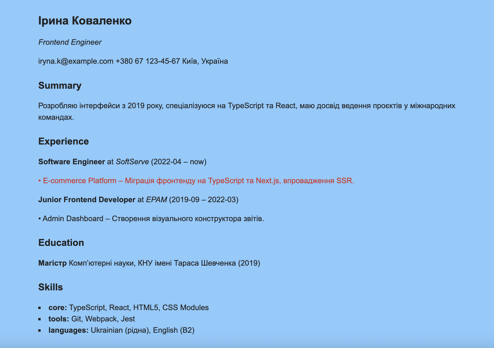

# README

Генератор резюме на чистому TypeScript/DOM, без фреймворків. Дані беруться з `resume.json`, сторінка збирається динамічно.  
У проєкті показані 5 патернів: **Facade**, **Template Method**, **Factory Method**, **Composite**, **Decorator**.

---

## Як реалізовані патерни

- **Facade** (`src/facade/ResumePage.ts`)  
  Єдина точка входу. `init('/resume.json')` → завантажує дані → запускає імпортера → рендерить сторінку.

- **Template Method** (`src/importer/AbstractImporter.ts` → `ResumeImporter.ts`)  
  Скелет алгоритму: `validate` → `map` → `render`.  
  У `ResumeImporter`:

  - `validate()` - перевіряє наявність блоків: header, summary, experience, education, skills;
  - `map()` — приводить «сирий» JSON до внутрішньої моделі `ResumeModel`;
  - `render()` — створює фабрику блоків і додає їх у `#resume-content`.

- **Factory Method** (`src/blocks/BlockFactory.ts`)  
  `createBlock(type, model)` повертає відповідний блок: `HeaderBlock`, `SummaryBlock`, `ExperienceBlock`, `EducationBlock`, `SkillsBlock`.

- **Composite** (`src/blocks/ExperienceBlock.ts` + `ProjectBlock.ts`)  
  `ExperienceBlock` — контейнер секції Experience, всередині рендерить список дочірніх `ProjectBlock` (листові вузли).

- **Decorator** (`src/decorators/HighlightDecorator.ts`)  
  Для проєктів з `isRecent: true` обгортаємо `ProjectBlock` у `HighlightDecorator`, який додає клас `.highlight` (візуальне підсвічування) без зміни логіки блоку.

---

## Як запустити

```
bash
npm install
npm run dev
```

# відкрити http://localhost:3000

Збірка у dist/:

```
npm run build
npm run preview
```

Усі стилі в src/styles.css. Контейнер для рендеру — <article id="resume-content"></article> у index.html.

## Звідки беруться дані

Редагуйте файл resume.json у корені проєкту (ім’я, контакти, досвід, освіта, навички). Після збереження сторінка оновиться (HMR).

Як додати новий блок (приклад: Certificates)
Оновіть модель
src/models/ResumeModel.ts

```
export interface Certificate { title: string; issuer: string; year: string; }
export interface ResumeModel {
// ...
certificates?: Certificate[];
}
```

Створіть блок
src/blocks/CertificatesBlock.ts

```
import { IBlock } from "./BlockFactory";
import { Certificate } from "../models/ResumeModel";

export class CertificatesBlock implements IBlock {
constructor(private items: Certificate[]) {}
render(): HTMLElement {
const sec = document.createElement("section");
sec.className = "section certificates";
sec.innerHTML = "<h2>Certificates</h2>";
const ul = document.createElement("ul");
this.items.forEach(c => {
const li = document.createElement("li");
li.textContent = `${c.title} — ${c.issuer} (${c.year})`;
ul.appendChild(li);
});
sec.appendChild(ul);
return sec;
}
}
```

Додайте гілку у фабрику
src/blocks/BlockFactory.ts

```
export type BlockType = "header" | "summary" | "experience" | "education" | "skills" | "certificates";

// у switch:
case "certificates":
return new CertificatesBlock((m as ResumeModel).certificates ?? []);

```

Підключіть у рендері імпортера
src/importer/ResumeImporter.ts (у render() після інших блоків):

```
if (model.certificates?.length) {
root.appendChild(factory.createBlock("certificates", model).render());
}
```

Додайте дані у resume.json (опційно):

```
"certificates": [
{ "title": "AWS Certified Cloud Practitioner", "issuer": "AWS", "year": "2024" }
]
```

Примітки
Підсвічування свіжих проєктів: виставте "isRecent": true у experience[].projects[] — Decorator додасть клас .highlight.

Стилі: для підсвічених елементів використовується .highlight { color: #c0392b; }.


